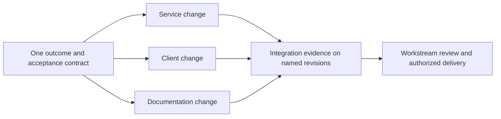

# Workstream application — end-user workflow candidate

**Status:** operator-opened product exploration, 2026-09-04. This describes a
candidate application of DotLn for everyday software work. It is not an
implemented interface, a deployment claim, a new release rung, or a replacement
for the separately named `προτείνω` thesis. The application identity and first
deployment remain unannounced; this public design uses synthetic work only.

The product question is what a person does when they sit down to work: start an
outcome, make the decisions that need their judgment, inspect the result, and
return later without reconstructing the process. DotLn should carry the
coordination that currently lives in repeated prompts, remembered procedure,
and scattered repository sessions. A successful existing workflow is an outcome
baseline to preserve, even when the mechanism carrying it has become expensive.

This is the author's reference application profile. Its selected evidence,
authority, privacy, and recovery mechanisms follow
[the platform/instance boundary](03-architecture.md#platform-and-instance-boundary).
Other owners may assemble a different profile; their visible capabilities must
match what they equip.

## Arriving at the desk

Open one workstream view through the available terminal or console. The first
screen answers: what changed since the last visit, which outcomes are in
progress, what needs a decision, and what can continue under existing authority.
Repository sessions and model conversations are drill-down views. The workstream
is the thing the operator returns to.

On a constrained managed host, first use selects an instance and observes its
available repository access, execution transports, and persistence capabilities.
The view names what is usable, unavailable, or still unobserved. It does not
promise an install, a remote worker, a provider connection, background operation,
or access to another machine. Deployment topology is an open product choice.

The operator selects repositories and the boundary of a proposed task. The
reference profile previews where its inputs and outputs would go and which
effects are authorized. An unavailable adapter leaves a concrete manual handoff
or a blocked capability, with the lost automation visible. Private source and
instance configuration stay in their governed environment. They are not setup
material for this public repository.

## One outcome from request to return

The following labels describe interactions, not proposed CLI command names.

| Moment | Operator action                                                                | Application response                                                                                                                                                                                           |
| ------ | ------------------------------------------------------------------------------ | -------------------------------------------------------------------------------------------------------------------------------------------------------------------------------------------------------------- |
| Start  | Describe the desired behavior in prose, or select a permitted source artifact. | Capture intent and source revision; show the outcome, known repository scope, assumptions, and completion criteria. An unclear request starts an exploration contract.                                         |
| Scope  | Correct the outcome or add a constraint.                                       | Inspect the relevant code and tests; propose the affected repositories, bounded work orders, dependencies, and required evidence. Show uncertainty where inspection has not established scope.                 |
| Begin  | Grant the displayed scope and effects, or use an applicable existing grant.    | Return a compact receipt: workstream, source revision, repository bases, current phase, evidence destination, next boundary, and whether input is needed.                                                      |
| Work   | Continue other work or inspect progress.                                       | Dispatch bounded episodes with the selected context and loadout; record results, failures, and continuations. Ask only for a material decision that existing authority cannot resolve.                         |
| Steer  | Change the desired outcome or answer a decision packet.                        | Record the change, identify affected plans and evidence, and retain still-valid work. A source revision change makes dependent claims visibly stale.                                                           |
| Review | Inspect a concrete result and its evidence.                                    | Present the behavior change, repository diffs, passing and failing checks, unresolved findings, and the next permitted action. In this profile, implementation readiness still needs independent verification. |
| Accept | Authorize the applicable merge, release, or other delivery boundary.           | Execute only that boundary when supported and authorized; distinguish verified, merged, released, and owner-accepted states. A blocked effect does not erase the prepared result.                              |
| Return | Reopen the workstream after an interruption or a new session.                  | Show the last trusted checkpoint, changes since departure, pending decisions, and the next legal action; resume from durable state.                                                                            |

The operator should not have to name a model for every routine step, shuttle
status between chats, or re-explain a settled decision after session turnover.
Role, model, effort, and transport choices remain inspectable and constrained by
the work order and environment. A quiet view means no decision is currently
required; it is never proof that an unobserved worker is still running.

## Replacing a successful but costly workflow

Migration starts with publicly expressible outcomes and synthetic scenarios.
No predecessor code, prompts, configuration, identifiers, or internal service
shapes are imported. Existing behavior is described afresh as what the operator
needs to happen, not how a predecessor implemented it.

Inventory the useful behaviors of both existing workflow generations
separately. Each obligation needs its own replacement and evidence; matching
their shared features does not prove parity with a capability present in only
one generation.

| Existing useful behavior to retain          | Candidate DotLn experience                                            | Evidence needed before retiring the old step                                                               |
| ------------------------------------------- | --------------------------------------------------------------------- | ---------------------------------------------------------------------------------------------------------- |
| A request becomes a scoped change.          | One captured outcome becomes a contract and bounded work orders.      | A synthetic request produces the expected acceptance criteria, non-goals, and material questions.          |
| Established standards guide implementation. | The task receives only the relevant mechanisms and source context.    | The important obligations still fire; startup and handoff burden are measured rather than assumed smaller. |
| Tests and review catch mistakes.            | Evidence remains attached to each claim and stage.                    | A planted defect reaches repair; unsupported completion cannot pass the selected gate.                     |
| An interrupted task can be recovered.       | A fresh session resumes the same durable objective.                   | Restart does not lose intent, repeat an external effect, or treat an unfinished step as complete.          |
| The operator knows what to do next.         | A concise receipt or decision packet replaces procedural restatement. | The operator can identify the next action and its reason without reopening earlier conversations.          |

Adopt one representative workflow increment at a time: describe and inspect a
single-repository task; prepare its change and evidence with manual delivery;
then exercise an authorized external worker and delivery boundary; finally
prove coordination across repositories. These are candidate adoption slices,
not a new build-order commitment. Keep a known-good way to finish the current
task until the corresponding slice has passed its acceptance demonstration.
Reusing an established working environment as a temporary execution edge is a
future adapter choice, not permission to bring its implementation here.

## One workstream across repositories

A workstream owns an outcome spanning repositories and time. A repository owns
its local code history, branch/worktree, tests, and delivery boundaries. Each
bounded work order names its repository bases and scope; the workstream view
relates those results without collapsing them into one repository or one long
model session.

Synthetic example: add a new optional response field in a service repository,
consume it in a client repository, and explain it in a documentation repository.
The operator starts one outcome and sees the dependency and compatibility plan.
The service and client still receive separate reviewable changes.

The graph describes evidence convergence; execution order follows the actual
dependency plan. A compatible service addition might land before its consumer,
while client work proceeds against a pinned fixture. The planner must make that
compatibility assumption explicit. A breaking contract would require a different
migration and delivery plan.

The workstream view shows each repository's base, current change, owner,
verification state, delivery state, and blockers, plus the cross-repository
acceptance evidence tied to exact revisions. A green service check cannot make
a failing client or stale integration check green. There is no assumed atomic
merge or rollback across repositories; partial delivery remains visible with
its next safe action.

Two workstreams may touch the same repository. They retain separate objectives
and evidence, with one writer per worktree in this profile. Shared-file or
contract conflicts become explicit coordination work before integration. A
change to a shared dependency identifies which workstream claims need renewed
evidence; it does not indiscriminately restart all work. Unrelated authorized
work may continue when one repository is blocked.

## What exists and what must be proved

The repository currently demonstrates a pure kernel, composition compiler,
deterministic skeleton, and its own file-based work-order/control loop. The
generated work-order index planned in WO-026 improves navigation of that loop.
It does not implement an end-user portfolio, repository coordinator, or live
external execution service.

The real-worker, independent-verification, feedback, and console rungs in
[the roadmap](06-roadmap.md) remain their existing authorities. This candidate
supplies scenarios for evaluating them; it adds no implementation acceptance
criteria to those orders. [Terminal/console parity](04-interfaces.md#terminal-first-console-equal),
[source and dispatch ports](03-architecture.md#ports-what-keeps-work-flavored-verticals-pluggable),
and [durable workstreams](02-domain-model.md#memory-and-observation) supply the
existing concepts. No schema, package boundary, UI framework, provider, host
layout, or new command is selected here.

Before declaring this a useful replacement, demonstrate a single-repository
task, a cross-repository task with a shared contract, a material source revision
change, two colliding workstreams, an unavailable execution edge, and a session
restart. Compare outcome quality, context restatement, manual handoffs,
unnecessary interruptions, and time to a trusted return state against a
synthetic baseline of the operator's successful workflow. The baseline and
acceptance thresholds still need to be chosen; smaller prompts alone are not
proof of a better application.

## Open product choices

- Which representative task best exposes the useful behaviors and the current
  coordination burden without requiring private source material?
- Which terminal, editor, and console entry points should the first slice
  expose, and what belongs on the initial workstream screen?
- Where does an instance keep its private workstream state, and which observed
  execution environments can participate without moving protected inputs?
- How should the operator define cross-repository acceptance, compatibility,
  conflict ownership, and partial-delivery recovery for the first pilot?
- What measurable parity and reduced coordination cost justify retiring each
  predecessor step, and which advanced behaviors can wait?

Resolve these through bounded scenario work and environment evidence. Naming
an application, adding its first integration, allocating a work order, and
announcing a deployment remain separate decisions.
